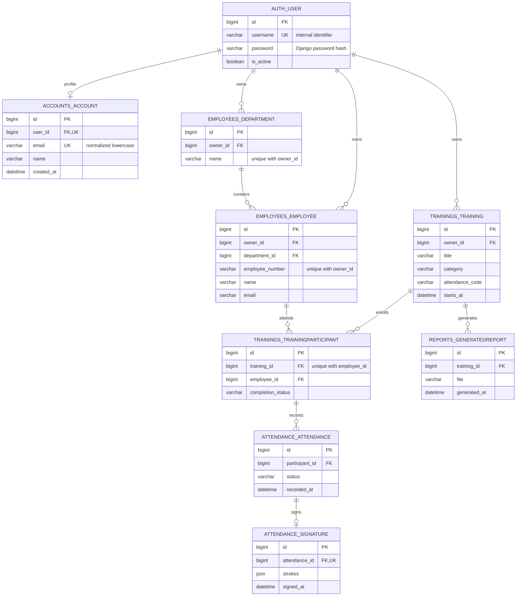

# 계정 및 교육 데이터 ERD



## 인증 및 소유권

- 기존 Django `auth_user`를 유지하고 `accounts_account`에 로그인 이메일과 표시 이름을 저장한다. 신규 계정의 내부 username은 UUID이며 이메일은 공백 제거·소문자 정규화 후 유일성을 보장한다.
- 로그인 세션은 Django 서버 세션과 HttpOnly 쿠키를 사용한다. 비밀번호는 Django 해시로 저장한다. 변경 API에는 CSRF 토큰이 필요하다.
- `/api/accounts/signup/`, `/login/`, `/logout/`은 POST, `/session/`은 GET이다. `/api/csrf/`에서 CSRF 쿠키를 받는다.
- 교육 생성 시 서버가 로그인 사용자를 owner로 지정한다. 다른 계정의 교육·명단·보고서·출석 수정 요청은 404, 미인증 관리 요청은 401을 반환한다.
- 부서명과 사번은 계정 내에서만 유일하다. 대상자·출석·서명·보고서는 교육의 소유권을 상속한다. 서로 다른 계정의 동일 사번이 같은 사원을 가리키지 않는다.
- QR 링크 `/?training=ID`는 로그인 없이 공개 교육 메타데이터만 조회한다. 출석 번호와 대상자·서명 목록은 제공하지 않는다. 출석 제출에는 기존의 이름·사번·출석 번호·서명이 필요하다.
- 슈퍼유저의 Django admin은 운영자 전용으로 전체 데이터를 관리한다. 일반 회원가입 계정에는 staff 권한이 없다.

## 적용 및 기존 데이터 이전

프로젝트 루트에서:

```powershell
venv/Scripts/python.exe BE/manage.py migrate
```

기존 데이터 보존을 위해 owner는 NULL을 허용한다. 소유자 없는 기존 데이터는 모든 일반 계정의 관리 화면에서 제외된다. 신규 교육은 API에서 항상 owner를 지정한다. 계정 등록 후 기존 데이터 전체를 가져올 계정을 명시한다:

```powershell
venv/Scripts/python.exe BE/manage.py assign_legacy_data --email manager@example.com
venv/Scripts/python.exe BE/manage.py assign_legacy_data --email manager@example.com --apply
```

첫 명령은 미리보기이며 두 번째만 실제로 이전한다. 기존 출석·서명 연결은 유지한다. 대상 계정에 중복 사번이나 부서가 있으면 전체 이전을 중단하므로 빈 계정으로 이전하는 것을 권장한다. 신규 가입자에게 기존 데이터를 자동 배정하지 않는다.

계정별 데모 생성:

```powershell
venv/Scripts/python.exe BE/manage.py seed_demo --email manager@example.com
```

검증:

```powershell
venv/Scripts/python.exe BE/manage.py test accounts trainings attendance reports
cd FE
npm run build
```

배포 데이터베이스에도 `migrate` 적용이 필요하다. 이번 작업은 로컬 데이터베이스에만 적용하며 배포는 별도로 진행한다.

로그인 디자인 참고: [FinacneFit/frontend LoginView](https://github.com/FinacneFit/frontend/blob/master/src/views/auth/LoginView.vue). 중앙 카드, 그라데이션 배경, 이메일 저장과 회원가입 연결을 hello HRD의 보라색 테마에 맞췄다.
