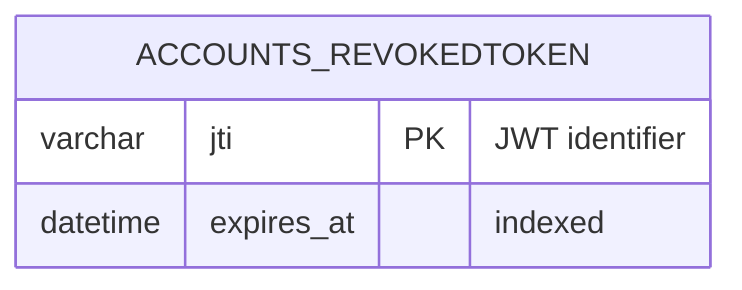

# JWT 계정 인증

앱의 회원가입·로그인·게스트 로그인은 PyJWT로 서명한 HS256 JWT를 발급한다. Django admin의 세션 인증은 유지하지만 `/api/`에서는 기존 Django 세션으로 인증할 수 없다. 기존 로그인 사용자는 전환 후 다시 로그인해야 한다.

## 만료와 저장

- 기본 유효 시간: 발급 시점부터 **1시간(3,600초)**. API 사용이나 새로고침으로 연장되지 않는다. Refresh token은 발급하지 않는다.
- JWT는 `hellohr_access` HttpOnly 쿠키에 저장한다. 경로는 `/api/`, SameSite는 Lax, 운영 환경은 Secure이다. JavaScript/localStorage에 토큰을 노출하지 않는다.
- 응답에는 사용자 정보, `expires_at`, `server_time`만 전달한다. 프론트엔드는 두 서버 시각의 차이로 타이머를 설정해 클라이언트 시계 차이를 보정한다.
- 시간이 지나면 화면의 계정·교육 상태를 초기화하고 로그인 화면을 보여 준다. 탭 복귀 시 재확인하고, 서버의 401 응답도 로그아웃으로 처리한다. 로그인·로그아웃 변경은 다른 탭에도 전파한다.
- 서버는 매 요청에서 서명, 고정 알고리즘, `exp`, `iat`, 발급자·대상, 사용자 활성 상태 및 비밀번호 변경 여부를 검증한다.
- JWT도 쿠키로 자동 전송되므로 로그인·로그아웃 및 모든 변경 요청의 CSRF 보호를 유지한다.

## 로그아웃

수동 로그아웃하면 쿠키를 삭제하고 토큰의 `jti`를 `accounts_revokedtoken`에 기록한다. 복사한 토큰도 재사용할 수 없으며, 같은 게스트 계정으로 접속한 다른 브라우저의 토큰에는 영향을 주지 않는다. 새 로그인으로 대체된 이전 토큰도 무효화한다.



만료된 무효화 기록은 더 이상 검증에 필요하지 않으므로 정기적으로 정리할 수 있다:

```powershell
venv/Scripts/python.exe BE/manage.py cleanup_expired_tokens
```

## 설정 및 배포

| 환경 변수 | 기본값 | 의미 |
| --- | --- | --- |
| `JWT_ACCESS_TTL_SECONDS` | `3600` | 토큰 수명(1~86,400초) |
| `DJANGO_JWT_SIGNING_KEY` | `DJANGO_SECRET_KEY` | JWT 서명용 서버 비밀키 |

운영에서는 충분히 긴 무작위 비밀키를 서버 환경 변수로 설정한다. 키를 변경하면 기존 토큰은 모두 무효화된다. `JWT_ACCESS_TTL_SECONDS` 변경은 새로 발급하는 토큰부터 적용된다.

```powershell
venv/Scripts/python.exe -m pip install -r requirements.txt
venv/Scripts/python.exe BE/manage.py migrate
```

`accounts.0003_revokedtoken`이 필요하며, 기존 계정과 게스트 교육 데이터는 그대로 유지된다. 실행 중인 Django 서버는 재시작해야 한다.

검증 명령:

```powershell
venv/Scripts/python.exe BE/manage.py test accounts trainings attendance reports
cd FE
node --test tests/auth.test.js
npm run build
```

JWT는 만료 시각을 가진 서명된 토큰이며, 자동 로그아웃은 서버 검증과 프론트엔드 타이머가 함께 처리한다. [PyJWT 공식 사용 문서](https://pyjwt.readthedocs.io/en/stable/usage.html)의 만료 검증 방식을 사용한다.
